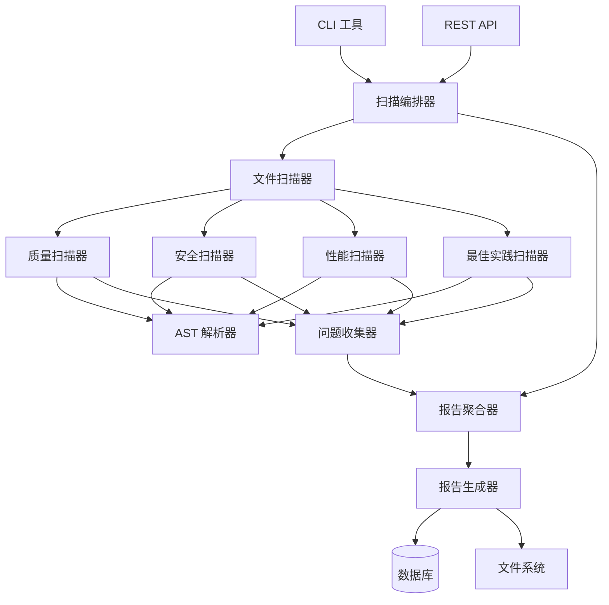
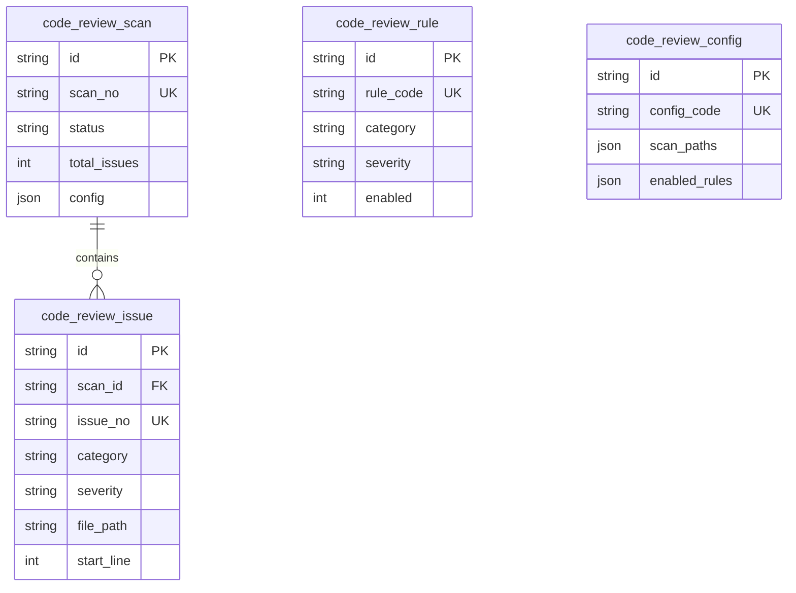

# 设计文档 - 代码审查系统

## 概述

代码审查系统是一个全面的静态代码分析工具,用于系统性地检查整个代码库(包括 backend、frontend、dev-tools 等模块),识别潜在问题、代码质量问题、安全隐患、性能问题、最佳实践违规等,并提供改进建议。

该系统将作为 NestJS 后端的一个独立模块实现,提供 CLI 工具和 API 接口,支持按需扫描和定期自动扫描。

### 设计目标

1. **全面性**: 覆盖代码质量、安全性、性能、最佳实践等多个维度
2. **可扩展性**: 支持添加新的扫描器和规则
3. **高性能**: 支持增量扫描和并行处理
4. **易用性**: 提供清晰的报告和可操作的修复建议
5. **集成性**: 可集成到 CI/CD 流程中

### 技术栈选择

基于研究和项目现状,选择以下技术栈:

- **AST 解析**: TypeScript Compiler API (`typescript` 包)
- **代码分析**: ESLint + 自定义规则
- **安全扫描**: npm audit + 自定义安全规则
- **复杂度分析**: 基于 AST 的自定义实现
- **报告生成**: Markdown + HTML + JSON
- **存储**: Prisma + MySQL (复用现有基础设施)

## 架构设计

### 系统架构



### 分层架构

1. **接口层** (Interface Layer)
   - CLI 命令行工具
   - REST API 接口
   - WebSocket 实时进度推送

2. **编排层** (Orchestration Layer)
   - 扫描任务调度
   - 并行处理控制
   - 进度跟踪

3. **分析层** (Analysis Layer)
   - 质量扫描器
   - 安全扫描器
   - 性能扫描器
   - 最佳实践扫描器

4. **基础层** (Foundation Layer)
   - AST 解析器
   - 文件系统访问
   - 规则引擎
   - 问题收集器

5. **存储层** (Storage Layer)
   - 数据库持久化
   - 报告文件生成

## 核心组件设计

### 1. 扫描编排器 (ScanOrchestrator)

负责协调整个扫描流程,管理扫描任务的生命周期。

**职责**:

- 初始化扫描配置
- 发现需要扫描的文件
- 分配扫描任务到各个扫描器
- 收集和聚合扫描结果
- 管理扫描进度和状态

**关键方法**:

```typescript
class ScanOrchestrator {
  async startScan(config: ScanConfig): Promise<ScanResult>;
  async pauseScan(scanId: string): Promise<void>;
  async resumeScan(scanId: string): Promise<void>;
  async cancelScan(scanId: string): Promise<void>;
  getProgress(scanId: string): ScanProgress;
}
```

### 2. 文件扫描器 (FileScanner)

负责遍历文件系统,识别需要扫描的文件。

**职责**:

- 递归遍历目录
- 应用文件过滤规则(gitignore、自定义规则)
- 支持增量扫描(基于文件修改时间)
- 文件分类(TypeScript、JavaScript、JSON、Prisma 等)

**关键方法**:

```typescript
class FileScanner {
  async scanDirectory(path: string, options: ScanOptions): Promise<FileInfo[]>;
  async getChangedFiles(since: Date): Promise<FileInfo[]>;
  shouldIgnoreFile(path: string): boolean;
  categorizeFile(path: string): FileCategory;
}
```

### 3. AST 解析器 (ASTParser)

负责将源代码解析为抽象语法树,供各个扫描器使用。

**职责**:

- 解析 TypeScript/JavaScript 代码
- 缓存 AST 结果
- 提供 AST 遍历工具
- 提供代码位置信息

**关键方法**:

```typescript
class ASTParser {
  parse(filePath: string, content: string): SourceFile;
  getNodeAtPosition(sourceFile: SourceFile, position: number): Node;
  findNodes(sourceFile: SourceFile, predicate: (node: Node) => boolean): Node[];
  getNodeText(node: Node): string;
  getNodeLocation(node: Node): Location;
}
```

### 4. 质量扫描器 (QualityScanner)

检查代码质量问题,包括编码规范、复杂度、重复代码等。

**检查项**:

- 未使用的变量、函数、导入
- 重复代码检测
- 命名约定验证
- 函数和文件长度检查
- 类型注解完整性
- 注释质量
- 圈复杂度计算
- 认知复杂度计算

**关键方法**:

```typescript
class QualityScanner implements Scanner {
  async scan(file: FileInfo, ast: SourceFile): Promise<Issue[]>;
  private checkUnusedCode(ast: SourceFile): Issue[];
  private checkDuplicateCode(ast: SourceFile): Issue[];
  private checkNamingConventions(ast: SourceFile): Issue[];
  private checkComplexity(ast: SourceFile): Issue[];
  private checkTypeAnnotations(ast: SourceFile): Issue[];
}
```

### 5. 安全扫描器 (SecurityScanner)

检查安全漏洞和隐患。

**检查项**:

- 硬编码的敏感信息(密码、API 密钥)
- SQL 注入风险
- XSS 漏洞
- 不安全的依赖包
- 身份认证和授权问题
- 不安全的文件上传
- 输入验证缺失
- 不安全的加密算法

**关键方法**:

```typescript
class SecurityScanner implements Scanner {
  async scan(file: FileInfo, ast: SourceFile): Promise<Issue[]>;
  private checkHardcodedSecrets(ast: SourceFile): Issue[];
  private checkSQLInjection(ast: SourceFile): Issue[];
  private checkXSS(ast: SourceFile): Issue[];
  private checkInsecureDependencies(): Promise<Issue[]>;
  private checkAuthImplementation(ast: SourceFile): Issue[];
}
```

### 6. 性能扫描器 (PerformanceScanner)

识别性能瓶颈和优化机会。

**检查项**:

- N+1 查询问题
- 缺失的数据库索引
- 未优化的循环
- 内存泄漏风险
- 同步阻塞操作
- 缺失的缓存策略
- Prisma 查询优化

**关键方法**:

```typescript
class PerformanceScanner implements Scanner {
  async scan(file: FileInfo, ast: SourceFile): Promise<Issue[]>;
  private checkNPlusOneQueries(ast: SourceFile): Issue[];
  private checkMissingIndexes(schema: PrismaSchema): Issue[];
  private checkInefficientLoops(ast: SourceFile): Issue[];
  private checkMemoryLeaks(ast: SourceFile): Issue[];
  private checkBlockingOperations(ast: SourceFile): Issue[];
}
```

### 7. 最佳实践扫描器 (BestPracticeScanner)

验证最佳实践的遵循情况。

**检查项**:

- NestJS 模块结构
- 依赖注入使用
- 错误处理模式
- API 设计规范
- 数据库设计规范
- Docker 配置
- 测试覆盖率

**关键方法**:

```typescript
class BestPracticeScanner implements Scanner {
  async scan(file: FileInfo, ast: SourceFile): Promise<Issue[]>;
  private checkNestJSPatterns(ast: SourceFile): Issue[];
  private checkErrorHandling(ast: SourceFile): Issue[];
  private checkAPIDesign(ast: SourceFile): Issue[];
  private checkDatabaseDesign(schema: PrismaSchema): Issue[];
}
```

### 8. 问题收集器 (IssueCollector)

收集和标准化各个扫描器发现的问题。

**职责**:

- 收集问题
- 去重
- 分类
- 优先级排序

**关键方法**:

```typescript
class IssueCollector {
  addIssue(issue: Issue): void;
  getIssues(): Issue[];
  getIssuesByCategory(category: IssueCategory): Issue[];
  getIssuesBySeverity(severity: Severity): Issue[];
  deduplicateIssues(): void;
}
```

### 9. 报告生成器 (ReportGenerator)

生成各种格式的审查报告。

**职责**:

- 生成 Markdown 报告
- 生成 HTML 报告
- 生成 JSON 报告
- 生成统计图表
- 生成修复建议

**关键方法**:

```typescript
class ReportGenerator {
  async generateMarkdownReport(issues: Issue[]): Promise<string>;
  async generateHTMLReport(issues: Issue[]): Promise<string>;
  async generateJSONReport(issues: Issue[]): Promise<object>;
  async generateStatistics(issues: Issue[]): Promise<Statistics>;
  async generateFixSuggestions(issues: Issue[]): Promise<FixSuggestion[]>;
}
```

## 数据模型

### 扫描会话 (code_review_scan)

存储扫描会话的基本信息。

```prisma
model code_review_scan {
  id              String   @id @default(cuid())
  create_time     DateTime @default(now())
  update_time     DateTime @updatedAt
  is_deleted      Int      @default(0)
  scan_no         String   @unique
  scan_type       String   // full, incremental
  status          String   // pending, running, completed, failed, cancelled
  start_time      DateTime
  end_time        DateTime?
  total_files     Int      @default(0)
  scanned_files   Int      @default(0)
  total_issues    Int      @default(0)
  critical_count  Int      @default(0)
  high_count      Int      @default(0)
  medium_count    Int      @default(0)
  low_count       Int      @default(0)
  config          Json     // 扫描配置
  platform_id     String?
  dept_id         String?
  operator_id     String?
  operator_name   String?

  issues          code_review_issue[]

  @@index([status, create_time])
  @@index([platform_id, dept_id])
}
```

### 问题记录 (code_review_issue)

存储发现的代码问题。

```prisma
model code_review_issue {
  id              String   @id @default(cuid())
  create_time     DateTime @default(now())
  update_time     DateTime @updatedAt
  is_deleted      Int      @default(0)
  scan_id         String
  issue_no        String   @unique
  category        String   // quality, security, performance, best_practice
  sub_category    String   // unused_code, hardcoded_secret, n_plus_one, etc.
  severity        String   // critical, high, medium, low
  title           String
  description     String   @db.Text
  file_path       String
  start_line      Int
  end_line        Int
  start_column    Int?
  end_column      Int?
  code_snippet    String?  @db.Text
  suggestion      String?  @db.Text
  auto_fixable    Int      @default(0)
  fix_code        String?  @db.Text
  status          String   @default("open") // open, fixed, ignored, wont_fix
  fixed_at        DateTime?
  fixed_by        String?
  ignore_reason   String?  @db.Text
  metadata        Json?    // 额外的元数据

  scan            code_review_scan @relation(fields: [scan_id], references: [id])

  @@index([scan_id, category])
  @@index([severity, status])
  @@index([file_path])
}
```

### 扫描规则 (code_review_rule)

存储可配置的扫描规则。

```prisma
model code_review_rule {
  id              String   @id @default(cuid())
  create_time     DateTime @default(now())
  update_time     DateTime @updatedAt
  is_deleted      Int      @default(0)
  rule_code       String   @unique
  rule_name       String
  category        String
  sub_category    String
  severity        String
  description     String   @db.Text
  enabled         Int      @default(1)
  config          Json?    // 规则配置参数
  platform_id     String?
  dept_id         String?

  @@index([category, enabled])
  @@index([platform_id, dept_id])
}
```

### 扫描配置 (code_review_config)

存储扫描配置模板。

```prisma
model code_review_config {
  id              String   @id @default(cuid())
  create_time     DateTime @default(now())
  update_time     DateTime @updatedAt
  is_deleted      Int      @default(0)
  config_name     String
  config_code     String   @unique
  description     String?  @db.Text
  scan_paths      Json     // 扫描路径列表
  ignore_patterns Json     // 忽略模式列表
  enabled_rules   Json     // 启用的规则列表
  severity_filter String   @default("all") // all, critical, high, medium, low
  is_default      Int      @default(0)
  platform_id     String?
  dept_id         String?

  @@index([platform_id, dept_id])
}
```

### 数据关系



## 组件和接口

### Scanner 接口

所有扫描器必须实现的统一接口。

```typescript
interface Scanner {
  name: string;
  category: IssueCategory;
  scan(file: FileInfo, ast?: SourceFile): Promise<Issue[]>;
  getSupportedFileTypes(): FileCategory[];
}

enum IssueCategory {
  QUALITY = "quality",
  SECURITY = "security",
  PERFORMANCE = "performance",
  BEST_PRACTICE = "best_practice",
}

enum Severity {
  CRITICAL = "critical",
  HIGH = "high",
  MEDIUM = "medium",
  LOW = "low",
}

interface Issue {
  category: IssueCategory;
  subCategory: string;
  severity: Severity;
  title: string;
  description: string;
  filePath: string;
  startLine: number;
  endLine: number;
  startColumn?: number;
  endColumn?: number;
  codeSnippet?: string;
  suggestion?: string;
  autoFixable: boolean;
  fixCode?: string;
  metadata?: Record<string, any>;
}
```

### 扫描配置

```typescript
interface ScanConfig {
  scanType: "full" | "incremental";
  scanPaths: string[];
  ignorePatterns: string[];
  enabledScanners: string[];
  enabledRules: string[];
  severityFilter: Severity[];
  maxParallelFiles: number;
  incrementalSince?: Date;
  outputFormats: ("markdown" | "html" | "json")[];
  outputPath: string;
}

interface ScanOptions {
  includeTests: boolean;
  includeNodeModules: boolean;
  maxFileSize: number; // bytes
  timeout: number; // milliseconds
}
```

### 文件信息

```typescript
interface FileInfo {
  path: string;
  relativePath: string;
  category: FileCategory;
  size: number;
  lastModified: Date;
  content?: string;
}

enum FileCategory {
  TYPESCRIPT = "typescript",
  JAVASCRIPT = "javascript",
  PRISMA = "prisma",
  JSON = "json",
  MARKDOWN = "markdown",
  DOCKER = "docker",
  YAML = "yaml",
  OTHER = "other",
}
```

### 扫描结果

```typescript
interface ScanResult {
  scanId: string;
  scanNo: string;
  status: ScanStatus;
  startTime: Date;
  endTime?: Date;
  totalFiles: number;
  scannedFiles: number;
  issues: Issue[];
  statistics: ScanStatistics;
  reports: ScanReport[];
}

enum ScanStatus {
  PENDING = "pending",
  RUNNING = "running",
  COMPLETED = "completed",
  FAILED = "failed",
  CANCELLED = "cancelled",
}

interface ScanStatistics {
  totalIssues: number;
  criticalCount: number;
  highCount: number;
  mediumCount: number;
  lowCount: number;
  issuesByCategory: Record<IssueCategory, number>;
  issuesByFile: Record<string, number>;
  topIssues: Issue[];
}

interface ScanReport {
  format: "markdown" | "html" | "json";
  path: string;
  size: number;
}
```

### REST API 接口

```typescript
// 启动扫描
POST /api/code-review/scans
Request: {
  config: ScanConfig
}
Response: {
  scanId: string
  scanNo: string
  status: ScanStatus
}

// 获取扫描进度
GET /api/code-review/scans/:scanId/progress
Response: {
  scanId: string
  status: ScanStatus
  progress: number // 0-100
  scannedFiles: number
  totalFiles: number
  currentFile: string
}

// 获取扫描结果
GET /api/code-review/scans/:scanId
Response: ScanResult

// 获取问题列表
GET /api/code-review/scans/:scanId/issues
Query: {
  category?: IssueCategory
  severity?: Severity
  status?: string
  page?: number
  pageSize?: number
}
Response: {
  issues: Issue[]
  total: number
  page: number
  pageSize: number
}

// 更新问题状态
PATCH /api/code-review/issues/:issueId
Request: {
  status: 'fixed' | 'ignored' | 'wont_fix'
  reason?: string
}
Response: Issue

// 获取扫描统计
GET /api/code-review/statistics
Query: {
  startDate?: string
  endDate?: string
  groupBy?: 'category' | 'severity' | 'file'
}
Response: {
  statistics: ScanStatistics
  trends: TrendData[]
}

// 获取规则列表
GET /api/code-review/rules
Query: {
  category?: IssueCategory
  enabled?: boolean
}
Response: {
  rules: Rule[]
}

// 更新规则配置
PATCH /api/code-review/rules/:ruleId
Request: {
  enabled?: boolean
  config?: Record<string, any>
}
Response: Rule
```

### CLI 命令

```bash
# 启动完整扫描
npm run code-review scan --config=default

# 启动增量扫描
npm run code-review scan --incremental --since="2024-01-01"

# 扫描特定目录
npm run code-review scan --path=backend/src

# 只扫描特定类别
npm run code-review scan --categories=security,performance

# 生成报告
npm run code-review report --scan-id=xxx --format=html,markdown

# 查看扫描历史
npm run code-review list

# 查看问题详情
npm run code-review issues --scan-id=xxx --severity=critical

# 导出问题列表
npm run code-review export --scan-id=xxx --format=csv
```

## 实现策略

### 1. 代码质量检查实现

#### 未使用代码检测

使用 TypeScript Compiler API 进行语义分析:

```typescript
function checkUnusedCode(sourceFile: SourceFile): Issue[] {
  const issues: Issue[] = [];
  const program = ts.createProgram([sourceFile.fileName], {});
  const checker = program.getTypeChecker();

  // 检查未使用的变量
  ts.forEachChild(sourceFile, function visit(node) {
    if (ts.isVariableDeclaration(node)) {
      const symbol = checker.getSymbolAtLocation(node.name);
      if (symbol) {
        const references = checker.findReferences(symbol);
        if (references.length === 1) {
          // 只有声明,没有使用
          issues.push(createIssue("unused_variable", node));
        }
      }
    }
    ts.forEachChild(node, visit);
  });

  return issues;
}
```

#### 重复代码检测

使用 AST 结构相似度算法:

```typescript
function checkDuplicateCode(sourceFile: SourceFile): Issue[] {
  const issues: Issue[] = [];
  const codeBlocks: CodeBlock[] = [];

  // 提取所有代码块
  ts.forEachChild(sourceFile, function visit(node) {
    if (isCodeBlock(node)) {
      codeBlocks.push({
        node,
        hash: calculateASTHash(node),
        text: node.getText(),
      });
    }
    ts.forEachChild(node, visit);
  });

  // 查找相似代码块
  for (let i = 0; i < codeBlocks.length; i++) {
    for (let j = i + 1; j < codeBlocks.length; j++) {
      const similarity = calculateSimilarity(
        codeBlocks[i].hash,
        codeBlocks[j].hash,
      );
      if (similarity > 0.8) {
        // 80% 相似度阈值
        issues.push(createDuplicateIssue(codeBlocks[i], codeBlocks[j]));
      }
    }
  }

  return issues;
}
```

#### 复杂度计算

实现圈复杂度和认知复杂度:

```typescript
function calculateCyclomaticComplexity(node: FunctionDeclaration): number {
  let complexity = 1; // 基础复杂度

  ts.forEachChild(node, function visit(child) {
    // 每个决策点增加复杂度
    if (
      ts.isIfStatement(child) ||
      ts.isForStatement(child) ||
      ts.isWhileStatement(child) ||
      ts.isDoStatement(child) ||
      ts.isCaseClause(child) ||
      ts.isCatchClause(child) ||
      ts.isConditionalExpression(child)
    ) {
      complexity++;
    }

    // 逻辑运算符
    if (ts.isBinaryExpression(child)) {
      if (
        child.operatorToken.kind === ts.SyntaxKind.AmpersandAmpersandToken ||
        child.operatorToken.kind === ts.SyntaxKind.BarBarToken
      ) {
        complexity++;
      }
    }

    ts.forEachChild(child, visit);
  });

  return complexity;
}

function calculateCognitiveComplexity(node: FunctionDeclaration): number {
  let complexity = 0;
  let nestingLevel = 0;

  function visit(child: Node) {
    // 嵌套结构增加复杂度
    if (isNestingStructure(child)) {
      nestingLevel++;
      complexity += nestingLevel;
    }

    // 中断控制流
    if (isControlFlowBreak(child)) {
      complexity++;
    }

    ts.forEachChild(child, visit);

    if (isNestingStructure(child)) {
      nestingLevel--;
    }
  }

  ts.forEachChild(node, visit);
  return complexity;
}
```

### 2. 安全检查实现

#### 硬编码敏感信息检测

使用正则表达式和 AST 分析:

```typescript
function checkHardcodedSecrets(sourceFile: SourceFile): Issue[] {
  const issues: Issue[] = [];

  const secretPatterns = [
    { name: "password", pattern: /password\s*[:=]\s*['"](.+?)['"]/i },
    { name: "api_key", pattern: /api[_-]?key\s*[:=]\s*['"](.+?)['"]/i },
    { name: "secret", pattern: /secret\s*[:=]\s*['"](.+?)['"]/i },
    { name: "token", pattern: /token\s*[:=]\s*['"](.+?)['"]/i },
    { name: "private_key", pattern: /private[_-]?key\s*[:=]\s*['"](.+?)['"]/i },
  ];

  const text = sourceFile.getText();

  for (const { name, pattern } of secretPatterns) {
    const matches = text.matchAll(new RegExp(pattern, "gi"));
    for (const match of matches) {
      // 排除环境变量引用
      if (!match[1].startsWith("process.env")) {
        issues.push(createSecurityIssue("hardcoded_secret", name, match));
      }
    }
  }

  return issues;
}
```

#### SQL 注入检测

检测原始 SQL 查询和字符串拼接:

```typescript
function checkSQLInjection(sourceFile: SourceFile): Issue[] {
  const issues: Issue[] = [];

  ts.forEachChild(sourceFile, function visit(node) {
    // 检测 prisma.$queryRaw 和 $executeRaw
    if (ts.isCallExpression(node)) {
      const expression = node.expression.getText();

      if (
        expression.includes("$queryRaw") ||
        expression.includes("$executeRaw")
      ) {
        // 检查是否使用了参数化查询
        const args = node.arguments;
        if (args.length > 0) {
          const firstArg = args[0];

          // 如果是模板字符串但没有使用 Prisma.sql
          if (ts.isTemplateExpression(firstArg)) {
            if (!expression.includes("Prisma.sql")) {
              issues.push(createSecurityIssue("sql_injection", node));
            }
          }

          // 如果是字符串拼接
          if (ts.isBinaryExpression(firstArg)) {
            issues.push(createSecurityIssue("sql_injection", node));
          }
        }
      }
    }

    ts.forEachChild(node, visit);
  });

  return issues;
}
```

#### XSS 漏洞检测

检测未转义的用户输入:

```typescript
function checkXSS(sourceFile: SourceFile): Issue[] {
  const issues: Issue[] = [];

  ts.forEachChild(sourceFile, function visit(node) {
    // 检测 dangerouslySetInnerHTML
    if (ts.isJsxAttribute(node)) {
      if (node.name.getText() === "dangerouslySetInnerHTML") {
        issues.push(createSecurityIssue("xss_risk", node));
      }
    }

    // 检测直接的 innerHTML 赋值
    if (ts.isBinaryExpression(node)) {
      const left = node.left.getText();
      if (left.includes(".innerHTML")) {
        issues.push(createSecurityIssue("xss_risk", node));
      }
    }

    ts.forEachChild(node, visit);
  });

  return issues;
}
```

### 3. 性能检查实现

#### N+1 查询检测

分析 Prisma 查询模式:

```typescript
function checkNPlusOneQueries(sourceFile: SourceFile): Issue[] {
  const issues: Issue[] = [];

  ts.forEachChild(sourceFile, function visit(node) {
    // 检测循环中的数据库查询
    if (isLoopStatement(node)) {
      let hasQuery = false;

      ts.forEachChild(node, function checkQuery(child) {
        if (ts.isCallExpression(child)) {
          const text = child.expression.getText();
          if (isPrismaQuery(text)) {
            hasQuery = true;
          }
        }
        ts.forEachChild(child, checkQuery);
      });

      if (hasQuery) {
        issues.push(
          createPerformanceIssue("n_plus_one", node, {
            suggestion: "考虑使用 include 或 select 进行关联查询",
          }),
        );
      }
    }

    ts.forEachChild(node, visit);
  });

  return issues;
}
```

#### 缺失索引检测

分析 Prisma schema:

```typescript
function checkMissingIndexes(schemaPath: string): Issue[] {
  const issues: Issue[] = [];
  const schema = parsePrismaSchema(schemaPath);

  for (const model of schema.models) {
    // 检查外键字段是否有索引
    for (const field of model.fields) {
      if (field.isRelation && !hasIndex(model, field.name)) {
        issues.push(
          createPerformanceIssue("missing_index", {
            model: model.name,
            field: field.name,
            suggestion: `添加索引: @@index([${field.name}])`,
          }),
        );
      }
    }

    // 检查常用查询字段是否有索引
    const queryFields = analyzeQueryPatterns(model.name);
    for (const field of queryFields) {
      if (!hasIndex(model, field)) {
        issues.push(
          createPerformanceIssue("missing_index", {
            model: model.name,
            field: field,
            suggestion: `考虑为常用查询字段添加索引`,
          }),
        );
      }
    }
  }

  return issues;
}
```

### 4. 最佳实践检查实现

#### NestJS 模式检查

验证 NestJS 架构模式:

```typescript
function checkNestJSPatterns(sourceFile: SourceFile): Issue[] {
  const issues: Issue[] = [];

  // 检查 Controller 是否正确使用装饰器
  ts.forEachChild(sourceFile, function visit(node) {
    if (ts.isClassDeclaration(node)) {
      const decorators = ts.getDecorators(node);
      const className = node.name?.getText();

      if (className?.endsWith("Controller")) {
        if (!hasDecorator(decorators, "Controller")) {
          issues.push(createBestPracticeIssue("missing_decorator", node));
        }
      }

      if (className?.endsWith("Service")) {
        if (!hasDecorator(decorators, "Injectable")) {
          issues.push(createBestPracticeIssue("missing_decorator", node));
        }
      }

      // 检查方法装饰器
      for (const member of node.members) {
        if (ts.isMethodDeclaration(member)) {
          const methodDecorators = ts.getDecorators(member);
          if (className?.endsWith("Controller")) {
            if (!hasHTTPMethodDecorator(methodDecorators)) {
              issues.push(
                createBestPracticeIssue("missing_http_decorator", member),
              );
            }
          }
        }
      }
    }

    ts.forEachChild(node, visit);
  });

  return issues;
}
```

#### 错误处理检查

验证错误处理模式:

```typescript
function checkErrorHandling(sourceFile: SourceFile): Issue[] {
  const issues: Issue[] = [];

  ts.forEachChild(sourceFile, function visit(node) {
    // 检查空的 catch 块
    if (ts.isCatchClause(node)) {
      const block = node.block;
      if (block.statements.length === 0) {
        issues.push(createBestPracticeIssue("empty_catch", node));
      }
    }

    // 检查未捕获的 Promise
    if (ts.isCallExpression(node)) {
      const text = node.getText();
      if (text.includes("async") || text.includes("Promise")) {
        // 检查是否有 .catch() 或 try-catch
        if (!hasErrorHandling(node)) {
          issues.push(createBestPracticeIssue("unhandled_promise", node));
        }
      }
    }

    ts.forEachChild(node, visit);
  });

  return issues;
}
```

### 5. 并行处理策略

使用 Worker Threads 进行并行扫描:

```typescript
class ParallelScanner {
  private workers: Worker[] = [];
  private maxWorkers: number;

  constructor(maxWorkers: number = os.cpus().length) {
    this.maxWorkers = maxWorkers;
  }

  async scanFiles(files: FileInfo[], scanners: Scanner[]): Promise<Issue[]> {
    const chunks = this.chunkFiles(files, this.maxWorkers);
    const promises: Promise<Issue[]>[] = [];

    for (const chunk of chunks) {
      const promise = this.scanChunk(chunk, scanners);
      promises.push(promise);
    }

    const results = await Promise.all(promises);
    return results.flat();
  }

  private async scanChunk(
    files: FileInfo[],
    scanners: Scanner[],
  ): Promise<Issue[]> {
    return new Promise((resolve, reject) => {
      const worker = new Worker("./scanner-worker.js");

      worker.postMessage({ files, scanners });

      worker.on("message", (issues: Issue[]) => {
        resolve(issues);
        worker.terminate();
      });

      worker.on("error", reject);
    });
  }

  private chunkFiles(files: FileInfo[], chunkCount: number): FileInfo[][] {
    const chunkSize = Math.ceil(files.length / chunkCount);
    const chunks: FileInfo[][] = [];

    for (let i = 0; i < files.length; i += chunkSize) {
      chunks.push(files.slice(i, i + chunkSize));
    }

    return chunks;
  }
}
```

### 6. 增量扫描策略

只扫描变更的文件:

```typescript
class IncrementalScanner {
  async getChangedFiles(since: Date): Promise<FileInfo[]> {
    const allFiles = await this.getAllFiles();
    const changedFiles: FileInfo[] = [];

    for (const file of allFiles) {
      const stats = await fs.stat(file.path);
      if (stats.mtime > since) {
        changedFiles.push(file);
      }
    }

    // 同时检查依赖关系
    const affectedFiles = await this.getAffectedFiles(changedFiles);

    return [...changedFiles, ...affectedFiles];
  }

  private async getAffectedFiles(
    changedFiles: FileInfo[],
  ): Promise<FileInfo[]> {
    const affected: Set<string> = new Set();

    for (const file of changedFiles) {
      // 查找导入此文件的其他文件
      const importers = await this.findImporters(file.path);
      importers.forEach((path) => affected.add(path));
    }

    return Array.from(affected).map((path) => ({ path /* ... */ }));
  }
}
```

## 错误处理

### 错误分类

1. **扫描错误** (Scan Errors)
   - 文件读取失败
   - AST 解析失败
   - 扫描器执行异常

2. **配置错误** (Configuration Errors)
   - 无效的扫描配置
   - 规则配置错误
   - 路径不存在

3. **系统错误** (System Errors)
   - 内存不足
   - 磁盘空间不足
   - 数据库连接失败

### 错误处理策略

#### 1. 文件级错误隔离

单个文件的扫描失败不应影响整体扫描:

```typescript
async scanFile(file: FileInfo, scanners: Scanner[]): Promise<FileScanResult> {
  const result: FileScanResult = {
    file,
    issues: [],
    errors: [],
    status: 'success',
  };

  try {
    // 解析 AST
    const ast = await this.astParser.parse(file.path, file.content);

    // 执行各个扫描器
    for (const scanner of scanners) {
      try {
        const issues = await scanner.scan(file, ast);
        result.issues.push(...issues);
      } catch (error) {
        // 记录扫描器错误,但继续执行其他扫描器
        result.errors.push({
          scanner: scanner.name,
          error: error.message,
          stack: error.stack,
        });
        this.logger.error(`Scanner ${scanner.name} failed for ${file.path}`, error);
      }
    }
  } catch (error) {
    // AST 解析失败
    result.status = 'failed';
    result.errors.push({
      phase: 'parse',
      error: error.message,
      stack: error.stack,
    });
    this.logger.error(`Failed to parse ${file.path}`, error);
  }

  return result;
}
```

#### 2. 超时处理

防止单个文件扫描时间过长:

```typescript
async scanFileWithTimeout(
  file: FileInfo,
  scanners: Scanner[],
  timeout: number = 30000
): Promise<FileScanResult> {
  return Promise.race([
    this.scanFile(file, scanners),
    new Promise<FileScanResult>((_, reject) =>
      setTimeout(() => reject(new Error('Scan timeout')), timeout)
    ),
  ]).catch(error => ({
    file,
    issues: [],
    errors: [{ error: error.message }],
    status: 'timeout',
  }));
}
```

#### 3. 重试机制

对于临时性错误实施重试:

```typescript
async scanFileWithRetry(
  file: FileInfo,
  scanners: Scanner[],
  maxRetries: number = 3
): Promise<FileScanResult> {
  let lastError: Error;

  for (let attempt = 1; attempt <= maxRetries; attempt++) {
    try {
      return await this.scanFile(file, scanners);
    } catch (error) {
      lastError = error;

      if (this.isRetryableError(error)) {
        this.logger.warn(`Retry ${attempt}/${maxRetries} for ${file.path}`);
        await this.delay(1000 * attempt); // 指数退避
      } else {
        throw error; // 不可重试的错误直接抛出
      }
    }
  }

  throw lastError;
}

private isRetryableError(error: Error): boolean {
  return (
    error.message.includes('EBUSY') ||
    error.message.includes('EMFILE') ||
    error.message.includes('EAGAIN')
  );
}
```

#### 4. 错误日志记录

详细记录错误信息用于调试:

```typescript
class ErrorLogger {
  async logScanError(error: ScanError): Promise<void> {
    await this.prisma.sys_error_log.create({
      data: {
        user_id: error.userId,
        username: error.username,
        request_method: "SCAN",
        api_path: "/code-review/scan",
        request_params: JSON.stringify(error.context),
        error_message: error.message,
        stack_trace: error.stack,
        platform_id: error.platformId,
        dept_id: error.deptId,
      },
    });

    // 同时记录到文件
    this.fileLogger.error({
      timestamp: new Date().toISOString(),
      error: error.message,
      stack: error.stack,
      context: error.context,
    });
  }
}
```

#### 5. 用户友好的错误消息

将技术错误转换为用户可理解的消息:

```typescript
function formatErrorMessage(error: Error): string {
  const errorMap: Record<string, string> = {
    ENOENT: "文件或目录不存在",
    EACCES: "没有访问权限",
    EMFILE: "打开的文件过多,请稍后重试",
    ENOMEM: "内存不足",
    "Parse error": "代码语法错误,无法解析",
  };

  for (const [key, message] of Object.entries(errorMap)) {
    if (error.message.includes(key)) {
      return message;
    }
  }

  return "扫描过程中发生未知错误,请查看日志";
}
```

### 错误恢复

#### 断点续扫

支持从失败点继续扫描:

```typescript
class ResumableScanner {
  async resumeScan(scanId: string): Promise<void> {
    // 获取扫描状态
    const scan = await this.prisma.code_review_scan.findUnique({
      where: { id: scanId },
    });

    if (!scan) {
      throw new Error("Scan not found");
    }

    // 获取已扫描的文件列表
    const scannedFiles = await this.getScannedFiles(scanId);

    // 获取所有需要扫描的文件
    const allFiles = await this.fileScanner.scanDirectory(
      scan.config.scanPaths,
    );

    // 过滤出未扫描的文件
    const remainingFiles = allFiles.filter(
      (file) => !scannedFiles.includes(file.path),
    );

    // 继续扫描
    await this.scanFiles(scanId, remainingFiles);
  }
}
```

## 测试策略

### 测试层次

1. **单元测试** (Unit Tests)
   - 测试各个扫描器的独立功能
   - 测试 AST 解析器
   - 测试问题收集器
   - 测试报告生成器

2. **集成测试** (Integration Tests)
   - 测试扫描编排器与各扫描器的集成
   - 测试数据库操作
   - 测试文件系统操作
   - 测试 API 端点

3. **端到端测试** (E2E Tests)
   - 测试完整的扫描流程
   - 测试 CLI 命令
   - 测试报告生成

### 单元测试示例

#### 测试质量扫描器

```typescript
describe("QualityScanner", () => {
  let scanner: QualityScanner;
  let astParser: ASTParser;

  beforeEach(() => {
    astParser = new ASTParser();
    scanner = new QualityScanner(astParser);
  });

  describe("checkUnusedCode", () => {
    it("should detect unused variables", async () => {
      const code = `
        const used = 1;
        const unused = 2;
        console.log(used);
      `;

      const file = createTestFile("test.ts", code);
      const ast = astParser.parse(file.path, code);
      const issues = await scanner.scan(file, ast);

      expect(issues).toHaveLength(1);
      expect(issues[0].subCategory).toBe("unused_variable");
      expect(issues[0].title).toContain("unused");
    });

    it("should detect unused imports", async () => {
      const code = `
        import { used, unused } from 'module';
        console.log(used);
      `;

      const file = createTestFile("test.ts", code);
      const ast = astParser.parse(file.path, code);
      const issues = await scanner.scan(file, ast);

      expect(issues).toHaveLength(1);
      expect(issues[0].subCategory).toBe("unused_import");
    });
  });

  describe("checkComplexity", () => {
    it("should detect high cyclomatic complexity", async () => {
      const code = `
        function complex(a, b, c, d, e) {
          if (a) {
            if (b) {
              if (c) {
                if (d) {
                  if (e) {
                    return 1;
                  }
                }
              }
            }
          }
          return 0;
        }
      `;

      const file = createTestFile("test.ts", code);
      const ast = astParser.parse(file.path, code);
      const issues = await scanner.scan(file, ast);

      const complexityIssue = issues.find(
        (i) => i.subCategory === "high_complexity",
      );
      expect(complexityIssue).toBeDefined();
      expect(complexityIssue.metadata.complexity).toBeGreaterThan(10);
    });
  });
});
```

#### 测试安全扫描器

```typescript
describe("SecurityScanner", () => {
  let scanner: SecurityScanner;
  let astParser: ASTParser;

  beforeEach(() => {
    astParser = new ASTParser();
    scanner = new SecurityScanner(astParser);
  });

  describe("checkHardcodedSecrets", () => {
    it("should detect hardcoded passwords", async () => {
      const code = `
        const config = {
          password: 'secret123',
          apiKey: 'abc123xyz',
        };
      `;

      const file = createTestFile("test.ts", code);
      const ast = astParser.parse(file.path, code);
      const issues = await scanner.scan(file, ast);

      expect(issues.length).toBeGreaterThanOrEqual(2);
      expect(issues.some((i) => i.title.includes("password"))).toBe(true);
      expect(issues.some((i) => i.title.includes("apiKey"))).toBe(true);
    });

    it("should not flag environment variables", async () => {
      const code = `
        const config = {
          password: process.env.PASSWORD,
          apiKey: process.env.API_KEY,
        };
      `;

      const file = createTestFile("test.ts", code);
      const ast = astParser.parse(file.path, code);
      const issues = await scanner.scan(file, ast);

      expect(issues).toHaveLength(0);
    });
  });

  describe("checkSQLInjection", () => {
    it("should detect SQL injection risk", async () => {
      const code = `
        async function getUser(id: string) {
          return prisma.$queryRaw\`SELECT * FROM users WHERE id = \${id}\`;
        }
      `;

      const file = createTestFile("test.ts", code);
      const ast = astParser.parse(file.path, code);
      const issues = await scanner.scan(file, ast);

      const sqlInjectionIssue = issues.find(
        (i) => i.subCategory === "sql_injection",
      );
      expect(sqlInjectionIssue).toBeDefined();
      expect(sqlInjectionIssue.severity).toBe("critical");
    });
  });
});
```

### 集成测试示例

```typescript
describe("ScanOrchestrator Integration", () => {
  let orchestrator: ScanOrchestrator;
  let prisma: PrismaClient;

  beforeAll(async () => {
    prisma = new PrismaClient();
    orchestrator = new ScanOrchestrator(prisma);
  });

  afterAll(async () => {
    await prisma.$disconnect();
  });

  it("should complete a full scan", async () => {
    const config: ScanConfig = {
      scanType: "full",
      scanPaths: ["./test-fixtures"],
      ignorePatterns: ["node_modules", "dist"],
      enabledScanners: ["quality", "security"],
      enabledRules: [],
      severityFilter: ["critical", "high", "medium", "low"],
      maxParallelFiles: 4,
      outputFormats: ["json"],
      outputPath: "./test-output",
    };

    const result = await orchestrator.startScan(config);

    expect(result.status).toBe("completed");
    expect(result.totalFiles).toBeGreaterThan(0);
    expect(result.scannedFiles).toBe(result.totalFiles);
    expect(result.issues.length).toBeGreaterThan(0);

    // 验证数据库记录
    const scan = await prisma.code_review_scan.findUnique({
      where: { id: result.scanId },
    });
    expect(scan).toBeDefined();
    expect(scan.status).toBe("completed");
  });

  it("should handle scan cancellation", async () => {
    const config: ScanConfig = {
      scanType: "full",
      scanPaths: ["./large-test-fixtures"],
      // ... other config
    };

    const scanPromise = orchestrator.startScan(config);

    // 等待扫描开始
    await new Promise((resolve) => setTimeout(resolve, 1000));

    // 取消扫描
    const progress = orchestrator.getProgress(scanPromise.scanId);
    await orchestrator.cancelScan(progress.scanId);

    const result = await scanPromise;
    expect(result.status).toBe("cancelled");
  });
});
```

### 测试数据准备

创建测试用的代码样本:

```typescript
// test-fixtures/quality-issues.ts
export const qualityIssuesFixture = `
  // 未使用的变量
  const unused = 1;

  // 过长的函数
  function veryLongFunction() {
    // ... 超过 50 行的代码
  }

  // 高复杂度函数
  function complexFunction(a, b, c) {
    if (a) {
      if (b) {
        if (c) {
          // ...
        }
      }
    }
  }

  // 缺少类型注解
  function noTypes(param) {
    return param;
  }
`;

// test-fixtures/security-issues.ts
export const securityIssuesFixture = `
  // 硬编码密码
  const password = 'secret123';

  // SQL 注入风险
  async function unsafeQuery(id: string) {
    return prisma.$queryRaw\`SELECT * FROM users WHERE id = \${id}\`;
  }

  // XSS 风险
  function renderHTML(userInput: string) {
    element.innerHTML = userInput;
  }
`;
```

### 测试覆盖率目标

- **单元测试覆盖率**: ≥ 80%
- **集成测试覆盖率**: ≥ 60%
- **关键路径覆盖率**: 100%

### 持续集成

在 CI/CD 流程中自动运行测试:

```yaml
# .github/workflows/test.yml
name: Test Code Review System

on: [push, pull_request]

jobs:
  test:
    runs-on: ubuntu-latest

    steps:
      - uses: actions/checkout@v2

      - name: Setup Node.js
        uses: actions/setup-node@v2
        with:
          node-version: "20"

      - name: Install dependencies
        run: npm ci

      - name: Run unit tests
        run: npm run test:unit

      - name: Run integration tests
        run: npm run test:integration

      - name: Generate coverage report
        run: npm run test:coverage

      - name: Upload coverage to Codecov
        uses: codecov/codecov-action@v2
```

## 正确性属性

_属性是一个特征或行为,应该在系统的所有有效执行中保持为真——本质上是关于系统应该做什么的形式化陈述。属性作为人类可读规范和机器可验证正确性保证之间的桥梁。_

### 属性 1: 文件扫描完整性

*对于任何*给定的文件路径列表和忽略模式,扫描器应该处理所有未被忽略的 TypeScript/JavaScript 文件,且每个文件只处理一次。

**验证需求: 1.1**

### 属性 2: 未使用代码检测准确性

*对于任何*包含声明但未使用的变量、函数或导入的代码,质量扫描器应该识别出这些未使用的声明,且不应将已使用的声明标记为未使用。

**验证需求: 1.2**

### 属性 3: 重复代码检测一致性

*对于任何*包含重复代码块的代码文件,如果两个代码块的相似度超过配置的阈值(默认 80%),扫描器应该识别出这些重复,且相似度计算应该是对称的(block A 与 block B 的相似度等于 block B 与 block A 的相似度)。

**验证需求: 1.3**

### 属性 4: 命名约定验证正确性

*对于任何*标识符(变量、函数、类),命名约定检查器应该根据标识符类型正确分类其命名风格(camelCase、PascalCase、UPPER_SNAKE_CASE),且对于违反约定的标识符应该提供正确的修复建议。

**验证需求: 1.4**

### 属性 5: 长度阈值检测准确性

*对于任何*函数或文件,如果其行数超过配置的阈值(函数 50 行,文件 500 行),扫描器应该报告长度问题,且报告的行数应该与实际行数一致。

**验证需求: 1.5**

### 属性 6: 类型注解检测完整性

*对于任何*函数参数或变量声明,如果缺少类型注解或使用了 `any` 类型,扫描器应该识别出这些类型问题,且不应将已正确标注类型的声明标记为问题。

**验证需求: 1.6**

### 属性 7: 报告完整性

*对于任何*扫描发现的问题,生成的报告应该包含文件路径、起始行号、结束行号和修复建议,且这些信息应该准确指向问题所在位置。

**验证需求: 1.8**

### 属性 8: 敏感信息检测准确性

*对于任何*包含硬编码密码、API 密钥或其他敏感信息的代码,安全扫描器应该识别出这些敏感信息,但不应将环境变量引用(如 `process.env.PASSWORD`)标记为硬编码。

**验证需求: 2.1**

### 属性 9: SQL 注入检测正确性

*对于任何*使用 Prisma `$queryRaw` 或 `$executeRaw` 的代码,如果使用字符串拼接而非参数化查询,安全扫描器应该报告 SQL 注入风险,且对于正确使用 `Prisma.sql` 的参数化查询不应报告问题。

**验证需求: 2.2**

### 属性 10: XSS 漏洞检测准确性

*对于任何*直接设置 `innerHTML` 或使用 `dangerouslySetInnerHTML` 的代码,安全扫描器应该报告 XSS 风险,且对于使用了适当转义的代码不应报告问题。

**验证需求: 2.3**

### 属性 11: 文件上传安全检测

*对于任何*处理文件上传的代码,如果缺少文件类型验证、大小限制或文件名清理,安全扫描器应该报告安全风险,且对于包含完整验证的代码不应报告问题。

**验证需求: 2.6**

### 属性 12: 输入验证检测完整性

*对于任何*处理用户输入的函数,如果缺少输入验证或数据清理,安全扫描器应该报告输入验证缺失,且对于包含验证的代码不应报告问题。

**验证需求: 2.7**

### 属性 13: 加密算法安全性检测

*对于任何*使用加密算法的代码,如果使用了不安全的算法(如 MD5、SHA1 用于密码哈希),安全扫描器应该报告安全风险,且对于使用安全算法(如 bcrypt、argon2)的代码不应报告问题。

**验证需求: 2.8**

### 属性 14: 安全问题严重程度分类

*对于任何*安全扫描器发现的安全问题,其严重程度应该被标记为 Critical 或 High,且严重程度的分配应该基于问题类型的一致规则。

**验证需求: 2.9**

### 属性 15: N+1 查询检测准确性

*对于任何*在循环内执行数据库查询的代码,性能扫描器应该报告 N+1 查询问题,且对于使用了 `include` 或批量查询的优化代码不应报告问题。

**验证需求: 3.1**

### 属性 16: 数据库索引建议正确性

*对于任何*Prisma schema 中的外键字段或常用查询字段,如果缺少索引,性能扫描器应该建议添加索引,且对于已有索引的字段不应重复建议。

**验证需求: 3.2**

### 属性 17: 循环优化检测

*对于任何*包含低效循环模式的代码(如嵌套循环、循环内的重复计算),性能扫描器应该识别出这些模式,且对于已优化的循环不应报告问题。

**验证需求: 3.3**

### 属性 18: 内存泄漏风险检测

*对于任何*添加事件监听器或创建定时器的代码,如果缺少相应的清理逻辑(removeEventListener、clearTimeout/clearInterval),性能扫描器应该报告内存泄漏风险,且对于包含清理逻辑的代码不应报告问题。

**验证需求: 3.4**

### 属性 19: 阻塞操作检测

*对于任何*使用同步 API 的代码(如 `fs.readFileSync`、`crypto.pbkdf2Sync`),性能扫描器应该报告阻塞操作风险,且对于使用异步 API 的代码不应报告问题。

**验证需求: 3.6**

### 属性 20: Prisma 查询优化建议

*对于任何*Prisma 查询,如果查询了不必要的字段或缺少 `select` 优化,性能扫描器应该提供优化建议,且建议应该包含具体的优化代码示例。

**验证需求: 3.8**

### 属性 21: Promise 错误处理检测

*对于任何*Promise 或 async 函数调用,如果缺少 `.catch()` 或 `try-catch` 错误处理,扫描器应该报告未捕获异常风险,且对于包含错误处理的代码不应报告问题。

**验证需求: 4.1**

### 属性 22: 空 catch 块检测

_对于任何_`try-catch` 语句,如果 `catch` 块为空或只包含注释,扫描器应该报告空 catch 块问题,且对于包含错误处理逻辑的 catch 块不应报告问题。

**验证需求: 4.2**

### 属性 23: 错误日志检测

*对于任何*错误处理代码,如果缺少错误日志记录(如 `logger.error()`、`console.error()`),扫描器应该报告缺失日志问题,且对于包含日志的代码不应报告问题。

**验证需求: 4.3**

### 属性 24: 输入验证错误处理检测

*对于任何*输入验证代码,如果验证失败时缺少适当的错误处理和响应,扫描器应该报告错误处理缺失,且对于包含完整错误处理的代码不应报告问题。

**验证需求: 4.6**

### 属性 25: 改进建议完整性

*对于任何*扫描发现的问题,报告应该包含具体的改进建议,且建议应该是可操作的(包含代码示例或明确的修复步骤)。

**验证需求: 4.7**

### 属性反思

在编写上述属性后,进行了属性反思以消除冗余:

1. **属性 7(报告完整性)和属性 25(改进建议完整性)** 可以合并,因为它们都是关于报告质量的。但由于它们验证不同的方面(位置信息 vs 建议内容),保持独立更清晰。

2. **属性 8、9、10、11、12、13** 都是安全检测相关,但每个检测不同类型的安全问题,不存在逻辑冗余。

3. **属性 15、16、17、18、19、20** 都是性能检测相关,但每个关注不同的性能方面,保持独立。

4. **属性 21、22、23、24** 都是错误处理相关,但每个检测不同的错误处理模式,不存在冗余。

所有属性都提供了独特的验证价值,没有发现需要合并或删除的冗余属性。

## 部署和运维

### 模块结构

```
backend/src/modules/code-review/
├── code-review.module.ts
├── controllers/
│   ├── scan.controller.ts
│   ├── issue.controller.ts
│   ├── rule.controller.ts
│   └── report.controller.ts
├── services/
│   ├── scan-orchestrator.service.ts
│   ├── file-scanner.service.ts
│   ├── ast-parser.service.ts
│   └── report-generator.service.ts
├── scanners/
│   ├── scanner.interface.ts
│   ├── quality-scanner.ts
│   ├── security-scanner.ts
│   ├── performance-scanner.ts
│   └── best-practice-scanner.ts
├── collectors/
│   └── issue-collector.ts
├── cli/
│   └── code-review.cli.ts
├── dto/
│   ├── scan-config.dto.ts
│   ├── issue.dto.ts
│   └── report.dto.ts
├── entities/
│   ├── scan.entity.ts
│   ├── issue.entity.ts
│   └── rule.entity.ts
└── utils/
    ├── complexity-calculator.ts
    ├── similarity-calculator.ts
    └── pattern-matcher.ts
```

### 配置管理

#### 环境变量

```env
# 代码审查配置
CODE_REVIEW_MAX_PARALLEL_FILES=4
CODE_REVIEW_SCAN_TIMEOUT=300000
CODE_REVIEW_MAX_FILE_SIZE=10485760
CODE_REVIEW_REPORT_PATH=./storage/code-review-reports
CODE_REVIEW_ENABLE_CACHE=true
CODE_REVIEW_CACHE_TTL=3600
```

#### 默认配置文件

```typescript
// config/code-review.config.ts
export default {
  scan: {
    maxParallelFiles: parseInt(process.env.CODE_REVIEW_MAX_PARALLEL_FILES) || 4,
    timeout: parseInt(process.env.CODE_REVIEW_SCAN_TIMEOUT) || 300000,
    maxFileSize: parseInt(process.env.CODE_REVIEW_MAX_FILE_SIZE) || 10485760,
  },
  report: {
    outputPath:
      process.env.CODE_REVIEW_REPORT_PATH || "./storage/code-review-reports",
    formats: ["markdown", "html", "json"],
  },
  cache: {
    enabled: process.env.CODE_REVIEW_ENABLE_CACHE === "true",
    ttl: parseInt(process.env.CODE_REVIEW_CACHE_TTL) || 3600,
  },
  rules: {
    quality: {
      maxFunctionLines: 50,
      maxFileLines: 500,
      maxComplexity: 10,
      maxCognitiveComplexity: 15,
      duplicateThreshold: 0.8,
    },
    security: {
      checkHardcodedSecrets: true,
      checkSQLInjection: true,
      checkXSS: true,
      checkInsecureDependencies: true,
    },
    performance: {
      checkNPlusOne: true,
      checkMissingIndexes: true,
      checkBlockingOperations: true,
    },
  },
};
```

### 数据库迁移

```sql
-- 创建代码审查相关表
-- migration: 20260420000000_add_code_review_tables

-- 扫描会话表
CREATE TABLE `code_review_scan` (
  `id` VARCHAR(191) NOT NULL,
  `create_time` DATETIME(3) NOT NULL DEFAULT CURRENT_TIMESTAMP(3),
  `update_time` DATETIME(3) NOT NULL,
  `is_deleted` INT NOT NULL DEFAULT 0,
  `scan_no` VARCHAR(191) NOT NULL,
  `scan_type` VARCHAR(191) NOT NULL,
  `status` VARCHAR(191) NOT NULL,
  `start_time` DATETIME(3) NOT NULL,
  `end_time` DATETIME(3) NULL,
  `total_files` INT NOT NULL DEFAULT 0,
  `scanned_files` INT NOT NULL DEFAULT 0,
  `total_issues` INT NOT NULL DEFAULT 0,
  `critical_count` INT NOT NULL DEFAULT 0,
  `high_count` INT NOT NULL DEFAULT 0,
  `medium_count` INT NOT NULL DEFAULT 0,
  `low_count` INT NOT NULL DEFAULT 0,
  `config` JSON NOT NULL,
  `platform_id` VARCHAR(191) NULL,
  `dept_id` VARCHAR(191) NULL,
  `operator_id` VARCHAR(191) NULL,
  `operator_name` VARCHAR(191) NULL,
  PRIMARY KEY (`id`),
  UNIQUE INDEX `code_review_scan_scan_no_key`(`scan_no`),
  INDEX `code_review_scan_status_create_time_idx`(`status`, `create_time`),
  INDEX `code_review_scan_platform_id_dept_id_idx`(`platform_id`, `dept_id`)
) ENGINE=InnoDB DEFAULT CHARSET=utf8mb4 COLLATE=utf8mb4_unicode_ci;

-- 问题记录表
CREATE TABLE `code_review_issue` (
  `id` VARCHAR(191) NOT NULL,
  `create_time` DATETIME(3) NOT NULL DEFAULT CURRENT_TIMESTAMP(3),
  `update_time` DATETIME(3) NOT NULL,
  `is_deleted` INT NOT NULL DEFAULT 0,
  `scan_id` VARCHAR(191) NOT NULL,
  `issue_no` VARCHAR(191) NOT NULL,
  `category` VARCHAR(191) NOT NULL,
  `sub_category` VARCHAR(191) NOT NULL,
  `severity` VARCHAR(191) NOT NULL,
  `title` VARCHAR(191) NOT NULL,
  `description` TEXT NOT NULL,
  `file_path` VARCHAR(191) NOT NULL,
  `start_line` INT NOT NULL,
  `end_line` INT NOT NULL,
  `start_column` INT NULL,
  `end_column` INT NULL,
  `code_snippet` TEXT NULL,
  `suggestion` TEXT NULL,
  `auto_fixable` INT NOT NULL DEFAULT 0,
  `fix_code` TEXT NULL,
  `status` VARCHAR(191) NOT NULL DEFAULT 'open',
  `fixed_at` DATETIME(3) NULL,
  `fixed_by` VARCHAR(191) NULL,
  `ignore_reason` TEXT NULL,
  `metadata` JSON NULL,
  PRIMARY KEY (`id`),
  UNIQUE INDEX `code_review_issue_issue_no_key`(`issue_no`),
  INDEX `code_review_issue_scan_id_category_idx`(`scan_id`, `category`),
  INDEX `code_review_issue_severity_status_idx`(`severity`, `status`),
  INDEX `code_review_issue_file_path_idx`(`file_path`),
  CONSTRAINT `code_review_issue_scan_id_fkey` FOREIGN KEY (`scan_id`) REFERENCES `code_review_scan`(`id`) ON DELETE CASCADE ON UPDATE CASCADE
) ENGINE=InnoDB DEFAULT CHARSET=utf8mb4 COLLATE=utf8mb4_unicode_ci;

-- 扫描规则表
CREATE TABLE `code_review_rule` (
  `id` VARCHAR(191) NOT NULL,
  `create_time` DATETIME(3) NOT NULL DEFAULT CURRENT_TIMESTAMP(3),
  `update_time` DATETIME(3) NOT NULL,
  `is_deleted` INT NOT NULL DEFAULT 0,
  `rule_code` VARCHAR(191) NOT NULL,
  `rule_name` VARCHAR(191) NOT NULL,
  `category` VARCHAR(191) NOT NULL,
  `sub_category` VARCHAR(191) NOT NULL,
  `severity` VARCHAR(191) NOT NULL,
  `description` TEXT NOT NULL,
  `enabled` INT NOT NULL DEFAULT 1,
  `config` JSON NULL,
  `platform_id` VARCHAR(191) NULL,
  `dept_id` VARCHAR(191) NULL,
  PRIMARY KEY (`id`),
  UNIQUE INDEX `code_review_rule_rule_code_key`(`rule_code`),
  INDEX `code_review_rule_category_enabled_idx`(`category`, `enabled`),
  INDEX `code_review_rule_platform_id_dept_id_idx`(`platform_id`, `dept_id`)
) ENGINE=InnoDB DEFAULT CHARSET=utf8mb4 COLLATE=utf8mb4_unicode_ci;

-- 扫描配置表
CREATE TABLE `code_review_config` (
  `id` VARCHAR(191) NOT NULL,
  `create_time` DATETIME(3) NOT NULL DEFAULT CURRENT_TIMESTAMP(3),
  `update_time` DATETIME(3) NOT NULL,
  `is_deleted` INT NOT NULL DEFAULT 0,
  `config_name` VARCHAR(191) NOT NULL,
  `config_code` VARCHAR(191) NOT NULL,
  `description` TEXT NULL,
  `scan_paths` JSON NOT NULL,
  `ignore_patterns` JSON NOT NULL,
  `enabled_rules` JSON NOT NULL,
  `severity_filter` VARCHAR(191) NOT NULL DEFAULT 'all',
  `is_default` INT NOT NULL DEFAULT 0,
  `platform_id` VARCHAR(191) NULL,
  `dept_id` VARCHAR(191) NULL,
  PRIMARY KEY (`id`),
  UNIQUE INDEX `code_review_config_config_code_key`(`config_code`),
  INDEX `code_review_config_platform_id_dept_id_idx`(`platform_id`, `dept_id`)
) ENGINE=InnoDB DEFAULT CHARSET=utf8mb4 COLLATE=utf8mb4_unicode_ci;
```

### 性能优化

#### 1. AST 缓存

```typescript
class ASTCache {
  private cache: Map<string, CacheEntry> = new Map();
  private maxSize: number = 1000;

  get(filePath: string, fileHash: string): SourceFile | null {
    const entry = this.cache.get(filePath);
    if (entry && entry.hash === fileHash) {
      entry.lastAccess = Date.now();
      return entry.ast;
    }
    return null;
  }

  set(filePath: string, fileHash: string, ast: SourceFile): void {
    if (this.cache.size >= this.maxSize) {
      this.evictLRU();
    }
    this.cache.set(filePath, {
      hash: fileHash,
      ast,
      lastAccess: Date.now(),
    });
  }

  private evictLRU(): void {
    let oldestKey: string;
    let oldestTime = Infinity;

    for (const [key, entry] of this.cache.entries()) {
      if (entry.lastAccess < oldestTime) {
        oldestTime = entry.lastAccess;
        oldestKey = key;
      }
    }

    if (oldestKey) {
      this.cache.delete(oldestKey);
    }
  }
}
```

#### 2. 增量扫描优化

```typescript
class IncrementalScanOptimizer {
  async optimizeScanPaths(
    allFiles: FileInfo[],
    lastScanTime: Date,
  ): Promise<FileInfo[]> {
    const changedFiles: FileInfo[] = [];
    const dependencyGraph = await this.buildDependencyGraph(allFiles);

    for (const file of allFiles) {
      if (file.lastModified > lastScanTime) {
        changedFiles.push(file);

        // 添加依赖此文件的其他文件
        const dependents = dependencyGraph.getDependents(file.path);
        changedFiles.push(...dependents);
      }
    }

    return this.deduplicateFiles(changedFiles);
  }
}
```

#### 3. 并行处理优化

```typescript
class OptimizedParallelScanner {
  async scanFiles(files: FileInfo[]): Promise<Issue[]> {
    // 按文件大小分组,大文件单独处理
    const { largeFiles, smallFiles } = this.groupBySize(files);

    // 小文件批量并行处理
    const smallFilePromises = this.batchProcess(smallFiles, 10);

    // 大文件逐个处理
    const largeFilePromises = largeFiles.map((file) => this.scanFile(file));

    const results = await Promise.all([
      ...smallFilePromises,
      ...largeFilePromises,
    ]);

    return results.flat();
  }
}
```

### 监控和告警

#### 1. 性能监控

```typescript
class ScanPerformanceMonitor {
  async recordScanMetrics(scan: ScanResult): Promise<void> {
    const metrics = {
      scanId: scan.scanId,
      duration: scan.endTime.getTime() - scan.startTime.getTime(),
      filesPerSecond: scan.totalFiles / (duration / 1000),
      issuesPerFile: scan.totalIssues / scan.totalFiles,
      avgFileSize: this.calculateAvgFileSize(scan),
      memoryUsage: process.memoryUsage(),
    };

    await this.metricsService.record("code_review_scan", metrics);
  }
}
```

#### 2. 错误告警

```typescript
class ScanErrorAlerter {
  async alertOnError(error: ScanError): Promise<void> {
    if (this.isCriticalError(error)) {
      await this.notificationService.sendAlert({
        level: "critical",
        title: "代码审查扫描失败",
        message: error.message,
        context: error.context,
      });
    }
  }

  private isCriticalError(error: ScanError): boolean {
    return (
      error.type === "database_error" ||
      error.type === "system_error" ||
      error.failureRate > 0.5
    );
  }
}
```

### 维护和升级

#### 1. 规则更新

定期更新扫描规则以适应新的最佳实践:

```typescript
class RuleUpdater {
  async updateRules(): Promise<void> {
    const newRules = await this.fetchLatestRules();

    for (const rule of newRules) {
      await this.prisma.code_review_rule.upsert({
        where: { rule_code: rule.code },
        update: {
          rule_name: rule.name,
          description: rule.description,
          config: rule.config,
        },
        create: rule,
      });
    }
  }
}
```

#### 2. 数据归档

定期归档旧的扫描记录:

```typescript
class ScanArchiver {
  async archiveOldScans(olderThan: Date): Promise<void> {
    const oldScans = await this.prisma.code_review_scan.findMany({
      where: {
        create_time: { lt: olderThan },
        status: "completed",
      },
      include: { issues: true },
    });

    // 导出到归档存储
    for (const scan of oldScans) {
      await this.exportToArchive(scan);
    }

    // 删除数据库记录
    await this.prisma.code_review_scan.deleteMany({
      where: {
        id: { in: oldScans.map((s) => s.id) },
      },
    });
  }
}
```

## 总结

本设计文档详细描述了代码审查系统的架构、组件、数据模型、实现策略和测试方法。该系统将为项目提供全面的代码质量保障,帮助团队及早发现和修复潜在问题,提升代码库的整体质量和可维护性。

### 关键特性

1. **全面的检查维度**: 覆盖代码质量、安全性、性能和最佳实践
2. **高性能**: 支持并行处理和增量扫描
3. **可扩展**: 易于添加新的扫描器和规则
4. **易用**: 提供 CLI 和 API 两种使用方式
5. **详细的报告**: 生成多种格式的报告,包含具体的修复建议

### 下一步

1. 实现核心扫描器(质量、安全、性能)
2. 开发 CLI 工具
3. 实现 REST API
4. 编写单元测试和集成测试
5. 生成初始规则集
6. 集成到 CI/CD 流程
