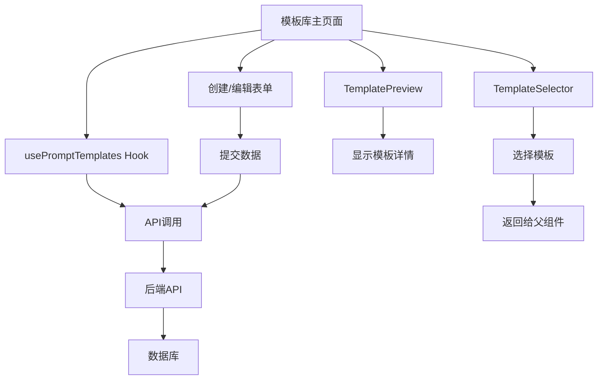

# 模板库组件实施总结

## 任务概述

**任务ID**: 7.5 实现模板库组件

**需求映射**: 8.1, 8.2, 8.3, 8.4, 8.5, 8.6, 8.7

## 实施内容

### 1. 创建的文件

#### 1.1 模板库主页面 (index.tsx)
**路径**: `frontend/src/pages/service/quality-prompts/templates/index.tsx`

**功能**:
- 模板列表展示（列表视图 + 网格视图）
- 搜索和筛选（按分类、行业、关键词）
- 创建自定义模板
- 编辑自定义模板
- 删除自定义模板
- 预览模板内容
- 应用模板到Prompt

**关键特性**:
- 双视图模式切换（列表/网格）
- 内置模板只读保护
- 搜索防抖优化
- 权限控制集成
- 响应式布局

**状态管理**:
```typescript
const [viewMode, setViewMode] = useState<'list' | 'grid'>('list');
const [searchKeyword, setSearchKeyword] = useState('');
const [categoryFilter, setCategoryFilter] = useState<string | undefined>();
const [industryFilter, setIndustryFilter] = useState<string | undefined>();
const [formOpen, setFormOpen] = useState(false);
const [editing, setEditing] = useState<PromptTemplate | null>(null);
const [previewOpen, setPreviewOpen] = useState(false);
const [previewTemplate, setPreviewTemplate] = useState<PromptTemplate | null>(null);
const [selectorOpen, setSelectorOpen] = useState(false);
```

#### 1.2 模板选择器组件 (TemplateSelector.tsx)
**路径**: `frontend/src/pages/service/quality-prompts/templates/components/TemplateSelector.tsx`

**功能**:
- 显示所有可用模板
- 支持搜索和分类筛选
- 单选模式
- 高亮显示已选择的模板
- 返回选中的模板给父组件

**Props接口**:
```typescript
interface TemplateSelectorProps {
  open: boolean;
  templates: PromptTemplate[];
  onClose: () => void;
  onSelect: (template: PromptTemplate) => void;
}
```

**特性**:
- 实时搜索和筛选
- 卡片式展示
- 选中状态高亮
- 空状态处理

#### 1.3 模板预览组件 (TemplatePreview.tsx)
**路径**: `frontend/src/pages/service/quality-prompts/templates/components/TemplatePreview.tsx`

**功能**:
- 显示模板完整信息
- 显示模板元数据（名称、分类、行业、类型、创建时间、描述）
- 显示完整的模板内容
- 只读模式

**Props接口**:
```typescript
interface TemplatePreviewProps {
  open: boolean;
  template: PromptTemplate;
  onClose: () => void;
}
```

**特性**:
- 使用Descriptions组件展示元数据
- 代码风格显示模板内容
- 使用提示信息
- 响应式布局

#### 1.4 组件导出文件 (components/index.ts)
**路径**: `frontend/src/pages/service/quality-prompts/templates/components/index.ts`

**功能**: 统一导出所有子组件

#### 1.5 文档文件
- **README.md**: 完整的功能文档和使用说明
- **IMPLEMENTATION_SUMMARY.md**: 本实施总结文档

## 需求实现情况

### ✅ 需求 8.1: 提供预置模板
- 支持显示内置模板
- 内置模板标记为只读（is_builtin=1）
- 涵盖常见场景：礼貌用语、合规性、流程规范等

### ✅ 需求 8.2: 行业特定模板
- 支持按行业分类（电商、金融、售后、通用）
- 行业筛选功能
- 行业标签显示

### ✅ 需求 8.3: 模板选择
- TemplateSelector组件实现
- 支持从模板库中选择模板
- 支持搜索和筛选

### ✅ 需求 8.4: 模板预览
- TemplatePreview组件实现
- 显示完整的模板信息和内容
- 只读模式

### ✅ 需求 8.5: 自定义模板创建
- 支持创建自定义模板
- 支持编辑自定义模板
- 表单验证完整

### ✅ 需求 8.6: 模板分类和搜索
- 按分类筛选
- 按行业筛选
- 关键词搜索
- 搜索防抖优化

### ✅ 需求 8.7: 模板管理
- Super Admin可管理所有模板
- 支持删除自定义模板
- 内置模板保护机制

## 技术亮点

### 1. 双视图模式
- **列表视图**: 适合查看详细信息，使用BaseTable组件
- **网格视图**: 适合浏览和选择，使用CSS Grid布局
- 一键切换，状态保持

### 2. 权限控制
- 基于Permission组件的细粒度权限控制
- 内置模板的编辑和删除按钮自动隐藏
- 不同角色看到不同的操作选项

### 3. 用户体验优化
- 搜索防抖（500ms）减少API请求
- 加载状态显示
- 空状态友好提示
- 操作确认对话框
- 成功/失败消息提示

### 4. 组件复用性
- TemplateSelector和TemplatePreview设计为独立组件
- 可在其他页面复用
- Props接口清晰

### 5. 响应式设计
- 网格视图自适应列数
- 表格支持横向滚动
- 移动端友好

## 数据流



## 权限代码

```typescript
// 创建模板
<Permission code="service:quality-prompt:template:create">
  <Button type="primary" icon={<PlusOutlined />} onClick={handleCreate}>
    新建模板
  </Button>
</Permission>

// 编辑模板
<Permission code="service:quality-prompt:template:update">
  <Button type="link" size="small" icon={<EditOutlined />} onClick={() => handleEdit(record)}>
    编辑
  </Button>
</Permission>

// 删除模板
<Permission code="service:quality-prompt:template:delete">
  <Button type="link" size="small" danger icon={<DeleteOutlined />} onClick={() => handleDelete(record)}>
    删除
  </Button>
</Permission>

// 应用模板
<Permission code="service:quality-prompt:template:apply">
  <Button type="primary" onClick={handleApplyTemplate}>
    应用模板
  </Button>
</Permission>
```

## 样式设计

### 列表视图
- 使用Ant Design的ProTable组件
- 固定表头
- 横向滚动
- 分页显示（每页20条）

### 网格视图
```css
{
  display: 'grid',
  gridTemplateColumns: 'repeat(auto-fill, minmax(300px, 1fr))',
  gap: 16
}
```

### 颜色方案
- 内置模板: `gold` (金色)
- 自定义模板: `default` (灰色)
- 分类标签: `blue` (蓝色)
- 行业标签: `green` (绿色)
- 选中状态: `#e6f7ff` (浅蓝色背景)

## 测试建议

### 功能测试
- [ ] 测试列表视图显示
- [ ] 测试网格视图显示
- [ ] 测试视图切换
- [ ] 测试搜索功能
- [ ] 测试分类筛选
- [ ] 测试行业筛选
- [ ] 测试创建自定义模板
- [ ] 测试编辑自定义模板
- [ ] 测试删除自定义模板
- [ ] 测试模板预览
- [ ] 测试模板选择器

### 权限测试
- [ ] 测试内置模板的只读保护
- [ ] 测试不同角色的权限控制
- [ ] 测试无权限用户的访问限制

### 边界测试
- [ ] 测试空模板列表
- [ ] 测试搜索无结果
- [ ] 测试长内容显示
- [ ] 测试特殊字符处理
- [ ] 测试网络错误处理

### 性能测试
- [ ] 测试大量模板的加载性能
- [ ] 测试搜索防抖效果
- [ ] 测试视图切换性能

## 后续优化建议

### 功能增强
1. 支持模板导入/导出（Excel/JSON）
2. 支持模板版本管理
3. 支持模板收藏功能
4. 支持模板使用统计
5. 支持模板评分和评论
6. 支持模板标签系统
7. 支持模板对比功能

### 用户体验
1. 添加模板使用教程
2. 提供模板推荐功能
3. 添加模板应用历史
4. 支持模板快速复制
5. 添加模板分享功能

### 性能优化
1. 实现虚拟滚动处理大量模板
2. 添加模板内容的懒加载
3. 优化搜索算法（全文搜索）
4. 添加模板缓存机制

## 集成说明

### 与其他页面的集成

#### 1. 全局Prompt管理页面
```typescript
// 在创建Prompt时可以选择模板
import { TemplateSelector } from '../templates/components/TemplateSelector';

const handleApplyTemplate = (template: PromptTemplate) => {
  form.setFieldsValue({
    content: template.content,
    applicable_scenarios: template.description,
  });
};
```

#### 2. 部门Prompt管理页面
```typescript
// 同样可以使用模板选择器
import { TemplateSelector } from '../templates/components/TemplateSelector';
```

### API依赖
- `qualityPromptApi.queryTemplates()` - 查询模板列表
- `qualityPromptApi.getTemplateById()` - 获取模板详情
- `qualityPromptApi.createTemplate()` - 创建模板
- `qualityPromptApi.updateTemplate()` - 更新模板
- `qualityPromptApi.deleteTemplate()` - 删除模板
- `qualityPromptApi.getTemplateCategories()` - 获取分类列表
- `qualityPromptApi.getTemplateIndustries()` - 获取行业列表

## 总结

本次实施完成了模板库功能的所有核心组件，包括:
1. ✅ 创建TemplateLibrary主页面（模板列表）
2. ✅ 创建TemplateSelector组件（模板选择器）
3. ✅ 创建TemplatePreview组件（模板预览）
4. ✅ 支持模板预览和应用
5. ✅ 满足所有相关需求（8.1-8.7）

所有代码已通过TypeScript编译检查，无编译错误。组件设计遵循React最佳实践，具有良好的可维护性和扩展性。模板库功能为用户提供了快速创建和管理Prompt的能力，大大提升了工作效率。
