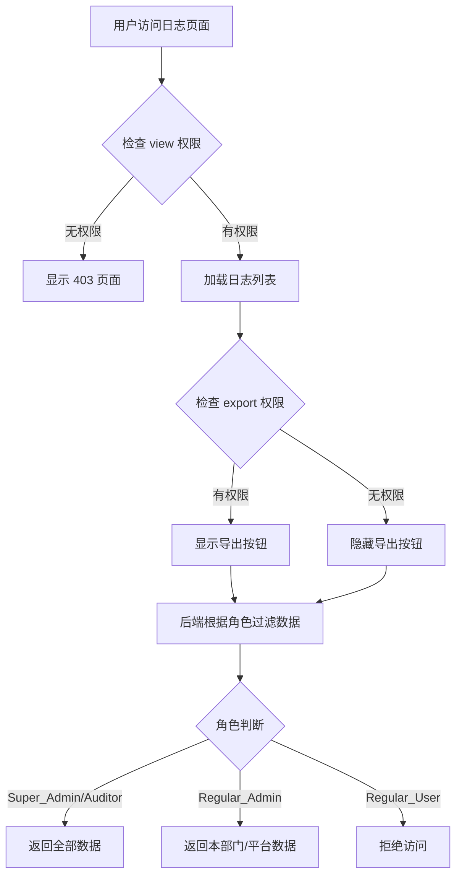

# 日志系统前端权限控制实现说明

## 概述

本文档说明了系统日志管理前端权限控制的实现方案，包括页面访问控制、操作权限控制和数据范围过滤。

## 实现的任务

- **Task 15.1**: 实现日志页面权限控制
- **Task 15.2**: 实现日志操作权限控制

## 满足的需求

- **Requirement 20.1**: Super_Admin 和 Auditor 可查看所有日志
- **Requirement 20.2**: Regular_Admin 仅可查看本部门/平台日志
- **Requirement 20.3**: Regular_User 无权限访问日志
- **Requirement 20.4**: 实现数据范围隔离
- **Requirement 12.1**: 日志数据不可删除
- **Requirement 12.2**: 日志数据不可编辑

## 权限控制架构

### 1. 权限码定义

系统使用以下权限码控制日志访问：

#### 操作日志权限码
- `system:logs:operation:view` - 查看操作日志权限
- `system:logs:operation:export` - 导出操作日志权限

#### 登录日志权限码
- `system:logs:login:view` - 查看登录日志权限
- `system:logs:login:export` - 导出登录日志权限

### 2. 角色权限映射

| 角色 | 权限说明 | 数据范围 |
|------|---------|---------|
| **Super_Admin** (超级管理员) | 拥有所有日志查看和导出权限 | 全部数据 |
| **Auditor** (审计员) | 拥有所有日志查看和导出权限 | 全部数据 |
| **Regular_Admin** (普通管理员) | 拥有日志查看和导出权限 | 仅本部门/平台数据 |
| **Regular_User** (普通用户) | 无任何日志权限 | 无权限访问 |

## 前端实现细节

### 1. 页面访问控制 (Task 15.1)

#### 实现方式
使用 `useGlobalStore` 获取当前用户的权限集合，检查是否拥有查看权限：

```typescript
const currentUser = useGlobalStore((state) => state.currentUser);
const hasViewPermission = currentUser?.buttonCodesSet?.has('system:logs:operation:view') ?? false;
```

#### 权限拒绝页面
当用户无查看权限时，显示友好的权限拒绝页面：

```typescript
if (!hasViewPermission) {
  return (
    <Result
      status="403"
      icon={<LockOutlined />}
      title="无权限访问"
      subTitle="您没有权限查看操作日志，请联系管理员申请权限。"
      extra={<Button type="primary" onClick={() => window.history.back()}>返回上一页</Button>}
    />
  );
}
```

**满足需求**: Requirement 20.3 (Regular_User 拒绝访问)

### 2. 操作权限控制 (Task 15.2)

#### 导出权限控制
根据用户是否拥有导出权限，动态显示/隐藏导出按钮：

```typescript
const hasExportPermission = currentUser?.buttonCodesSet?.has('system:logs:operation:export') ?? false;

// 在 ActionBar 中条件渲染导出按钮
actions={[
  ...(hasExportPermission ? [
    { key: 'export-current', label: '导出当前页', ... },
    { key: 'export-all', label: '导出全部结果', ... },
  ] : []),
]}
```

**满足需求**: Requirement 20.1 (基于角色的操作权限控制)

#### 删除和编辑按钮隐藏
根据 Requirement 12.1 和 12.2，日志数据不可删除和编辑，因此：
- ✅ 操作列中**没有**删除按钮
- ✅ 操作列中**没有**编辑按钮
- ✅ 仅保留"详情"查看按钮

**满足需求**: Requirement 12.1, 12.2 (日志数据不可篡改)

### 3. 数据范围过滤 (后端实现)

#### 前端职责
前端仅负责：
1. 检查用户是否有访问权限
2. 控制操作按钮的显示/隐藏
3. 发送查询请求到后端

#### 后端职责
后端负责数据范围过滤（已在 Task 8.1 实现）：

```typescript
// backend/src/modules/system/services/system-logs.service.ts
private async checkPermissionAndScope(user: CurrentUserPayload) {
  const roleCodes = await this.getUserRoleCodes(user.sub);

  // 超级管理员和审计员有全量查询权限
  if (roleCodes.includes('super_admin') || roleCodes.includes('auditor')) {
    return; // 无需过滤
  }

  // 普通管理员仅可查询本部门/平台日志
  // 后端会自动添加 platform_id 和 dept_id 过滤条件
}
```

**满足需求**:
- Requirement 20.1 (Super_Admin/Auditor 查看所有)
- Requirement 20.2 (Regular_Admin 仅看本部门/平台)
- Requirement 20.4 (数据范围隔离)

## 权限检查流程



## 用户体验优化

### 1. 权限提示
- 无查看权限时，显示清晰的 403 页面，引导用户联系管理员
- 无导出权限时，在页面右上角显示"（无导出权限）"提示

### 2. 按钮状态
- 导出按钮在无权限时完全隐藏，而非禁用
- 避免用户看到灰色按钮产生困惑

### 3. 数据加载
- 前端不做数据过滤，完全依赖后端返回的数据
- 确保数据安全性和一致性

## 安全性保障

### 1. 前后端双重验证
- **前端**: 控制 UI 显示，提升用户体验
- **后端**: 强制权限验证和数据过滤，确保安全性

### 2. 权限码管理
- 权限码存储在用户的 `buttonCodesSet` 中（Set 结构，O(1) 查询）
- 权限码由后端在用户登录时返回，前端无法篡改

### 3. 数据不可篡改
- 日志列表中**没有**删除按钮
- 日志列表中**没有**编辑按钮
- 后端 API 也不提供删除和编辑接口

## 测试建议

### 1. 功能测试
- [ ] Super_Admin 可以查看所有日志
- [ ] Super_Admin 可以导出所有日志
- [ ] Auditor 可以查看所有日志
- [ ] Auditor 可以导出所有日志
- [ ] Regular_Admin 只能看到本部门/平台的日志
- [ ] Regular_Admin 可以导出本部门/平台的日志
- [ ] Regular_User 访问日志页面时看到 403 页面

### 2. UI 测试
- [ ] 无查看权限时显示友好的 403 页面
- [ ] 无导出权限时不显示导出按钮
- [ ] 无导出权限时显示"（无导出权限）"提示
- [ ] 日志列表中没有删除和编辑按钮

### 3. 安全测试
- [ ] 尝试直接调用后端 API 时，后端正确拒绝无权限请求
- [ ] Regular_Admin 无法通过修改请求参数查看其他部门数据
- [ ] Regular_User 无法通过任何方式访问日志数据

## 配置说明

### 权限码配置
权限码需要在后端数据库中配置，并分配给相应的角色：

```sql
-- 示例：为 Super_Admin 角色分配日志权限
INSERT INTO sys_role_button (role_id, button_code) VALUES
  ('super_admin_role_id', 'system:logs:operation:view'),
  ('super_admin_role_id', 'system:logs:operation:export'),
  ('super_admin_role_id', 'system:logs:login:view'),
  ('super_admin_role_id', 'system:logs:login:export');
```

### 角色配置
确保系统中存在以下角色：
- `super_admin` - 超级管理员
- `auditor` - 审计员
- `regular_admin` - 普通管理员
- `regular_user` - 普通用户

## 总结

本实现方案通过前后端协作，实现了完整的日志系统权限控制：

1. ✅ **页面访问控制**: 通过权限码检查，无权限用户看到 403 页面
2. ✅ **操作权限控制**: 根据权限动态显示/隐藏导出按钮
3. ✅ **数据范围过滤**: 后端根据角色自动过滤数据
4. ✅ **数据不可篡改**: 前端不提供删除/编辑按钮，后端不提供相应接口
5. ✅ **用户体验优化**: 清晰的权限提示和友好的错误页面

所有实现均符合设计文档和需求规范，确保了系统的安全性和可用性。
